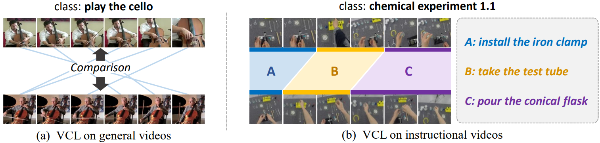
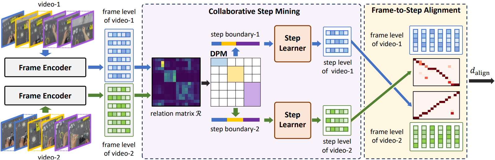
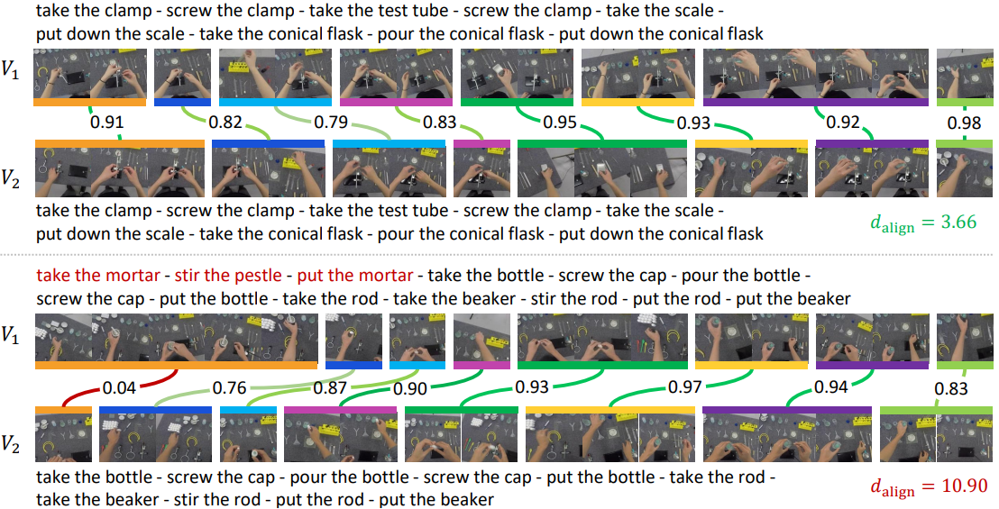
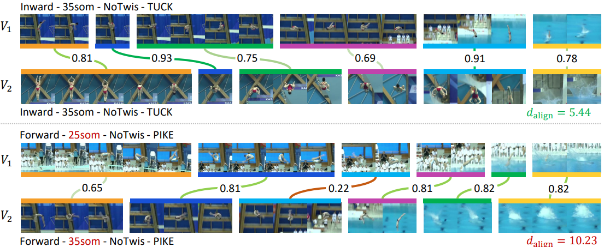

#  [Collaborative Weakly Supervised Video Correlation Learning for Procedure-Aware Instructional Video Analysis](https://ojs.aaai.org/index.php/AAAI/article/view/27983)



**Collaborative Weakly Supervised Video Correlation Learning for Procedure-Aware Instructional Video Analysis**
Tianyao He, Huabin Liu, Yuxi Li, Xiao Ma, Cheng Zhong, Yang Zhang, Weiyao Lin

> **Abstract:** *Video Correlation Learning (VCL), which aims to analyze the relationships between videos, has been widely studied and applied in various general video tasks. However, applying VCL to instructional videos is still quite challenging due to their intrinsic procedural temporal structure. Specifically, procedural knowledge is critical for accurate correlation analyses on instructional videos. Nevertheless, current procedure-learning methods heavily rely on step-level annotations, which are costly and not scalable. To address this problem, we introduce a weakly supervised framework called Collaborative Procedure Alignment (CPA) for procedure-aware correlation learning on instructional videos. Our framework comprises two core modules: collaborative step mining and frame-to-step alignment. The collaborative step mining module enables simultaneous and consistent step segmentation for paired videos, leveraging the semantic and temporal similarity between frames. Based on the identified steps, the frame-to-step alignment module performs alignment between the frames and steps across videos. The alignment result serves as a measurement of the correlation distance between two videos. We instantiate our framework in two distinct instructional video tasks: sequence verification and action quality assessment. Extensive experiments validate the effectiveness of our approach in providing accurate and interpretable correlation analyses for instructional videos.*

## Framework



## News

- [2024.10] ⭐️The journal version ***Achieving Procedure-Aware Instructional Video Correlation Learning under Weak Supervision from a Collaborative Perspective*** has been accepted by IJCV!
- [2023.11]⭐️Our conference paper ***Collaborative Weakly Supervised Video Correlation Learning for Procedure-Aware Instructional Video Analysis*** has been accepted by AAAI 2024!  [[Paper]]([https://arxiv.org/abs/2312.14135](https://ojs.aaai.org/index.php/AAAI/article/view/27983))

This repository is the PyTorch implementation of our journal version paper.

## Installation

Requirements:

- Python >= 3.7
- torch >= 1.7.1
- torchvision (version corresponding with torch)
- tqdm
- yacs
- einops
- sklearn
- decord
- pytorchvideo

You can also create environments with the following command:

``` bash
conda create -n CPA python=3.7
conda activate CPA
pip install -r requirements.txt
```

## Data preparation 

1. Download and prepare the CSV, Diving-SV and COIN-SV datasets:

   We use the datasets provided by [SVIP](https://github.com/svip-lab/SVIP-Sequence-VerIfication-for-Procedures-in-Videos). Please refer to [here](https://github.com/svip-lab/SVIP-Sequence-VerIfication-for-Procedures-in-Videos/tree/main/Datasets) for detailed instructions on data preparation. All datasets should be prepared in the `Datasets/` folder.

   > Datasets
   >
   > |--COIN-SV
   >
   > |--CSV
   >
   > |--DIVING48-SV

2. Download the Kinetics-400 pretrained model:

   Link: [here](https://pan.baidu.com/s/1sJU_u1QWLpeNVjymoqGO3g?pwd=bs6b)  Extraction code：bs6b

## Training and Evaluation

For training and evaluating our CPA model, run the following commands:

```bash
# training on CSV
python run_files/SV_CSV/train_CPA_learnStep.py
# evaluating on CSV
python run_files/SV_CSV/eval_CPA_learnStep.py

# training on Diving-SV
python run_files/SV_Diving/train_CPA_learnStep_diving.py
# evaluating on Diving-SV
python run_files/SV_Diving/eval_CPA_learnStep_diving.py

# training on COIN-SV
python run_files/SV_COIN_SV/train_CPA_learnStep.py
# evaluating on COIN-SV
python run_files/SV_COIN_SV/eval_CPA_learnStep.py
```

## Visualization





## Citation 

If you find this code useful, please cite our paper:

~~~~bibtex
@article{he2023collaborative,
  title={Collaborative Weakly Supervised Video Correlation Learning for Procedure-Aware Instructional Video Analysis},
  author={He, Tianyao and Liu, Huabin and Li, Yuxi and Ma, Xiao and Zhong, Cheng and Zhang, Yang and Lin, Weiyao},
  journal={arXiv preprint arXiv:2312.11024},
  year={2023}
}
~~~~

